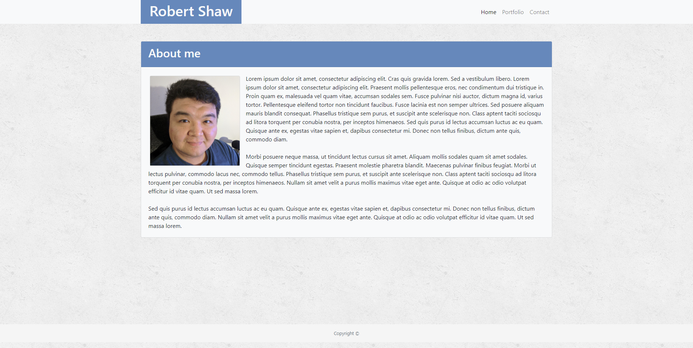

# Bootstrap-Portfolio
Portfolio made with BootstrapCDN v4.1.0

This is a protoype for a responsive portfolio built using the bootstrap framework. The layout automatically resizes based on the size of the screen it's being used on, providing increased readability across a variety of devices.

## Getting Started

Open up the [project link](https://robertshaw87.github.io/Bootstrap-Portfolio/) and you should be able to see the example webpage shown below:



### Prerequisites

You need to have a modern browser able to handle html5 and css. 

Some popular browsers are:
```
Google Chrome
Mozilla Firefox
Safari
Opera
Edge
```

### Installing

No installation needed! Just open the page in your preferred browser.

## Built With

* Html

* CSS

* [BootstrapCDN v4.1.0](https://getbootstrap.com/docs/4.1/getting-started/introduction/) - The web framework used

## Authors

* **Robert Shaw** - *Initial work* - [robertshaw87](https://github.com/robertshaw87)
